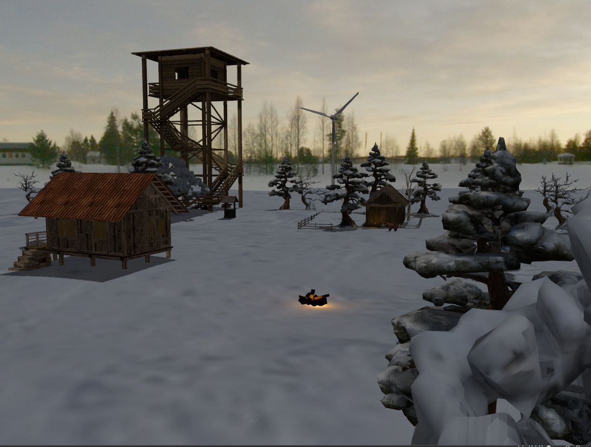
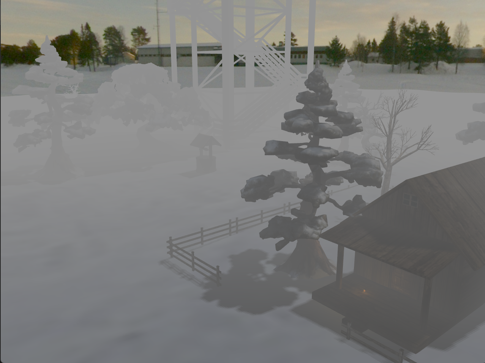
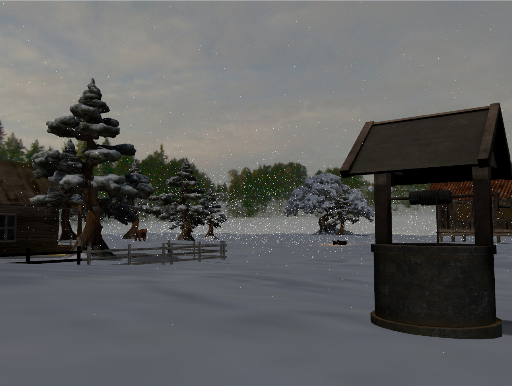
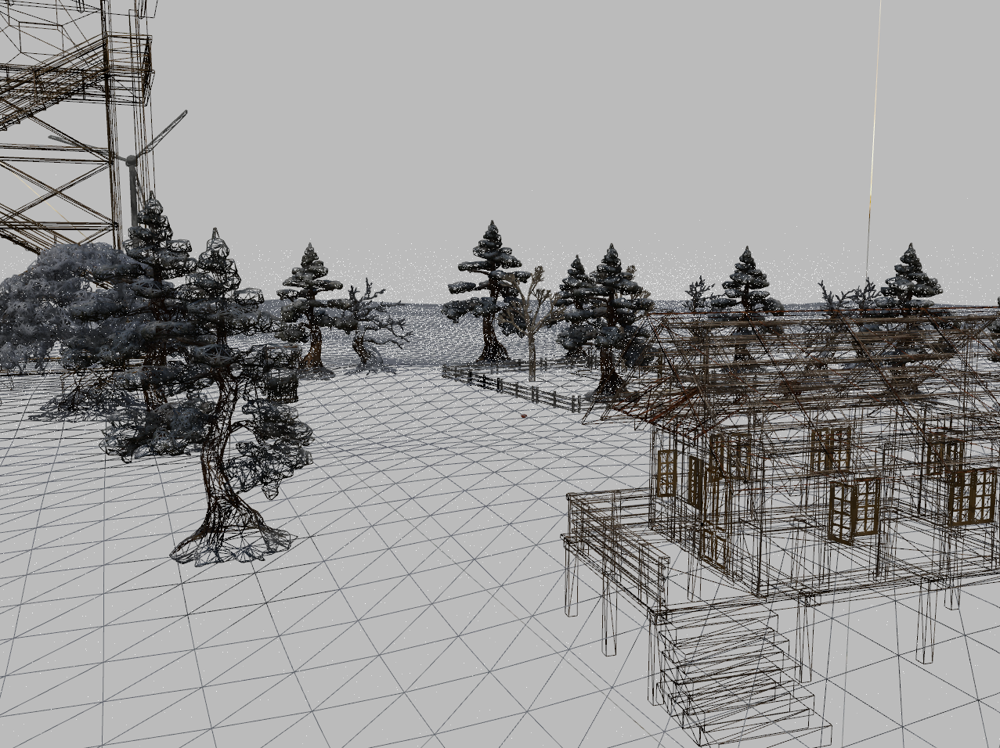

# 🌲 OpenGL 3D Winter Scene
This project is a 3D computer graphics application developed in C++ using OpenGL. It renders a complex, photorealistic winter scene featuring advanced lighting, shadowing, and particle effects.

The application allows users to explore a detailed 3D environment, demonstrating mastery of the graphics pipeline, shader programming, and scene management.

## 🚀 Key Features
### 1. Camera & Navigation
- Free Camera: First-person style navigation using Keyboard (WASD) and Mouse.
- Automated Tour: A cinematic camera animation that orbits the central scene (Press P).

### 2. Advanced Lighting
The scene features multiple light sources managed via GLSL shaders:

- Directional Light (Sun): Simulates global daylight and generates dynamic shadows (Toggle: K).
- Point Lights: 
  - Lantern: A static local light source attached to a structure (Toggle: L).
  - Campfire: A dynamic light source with a flickering effect animated in real-time using mathematical functions (Toggle: C).
 
### 3. Visual Effects & Photorealism
- Shadow Mapping: Dynamic shadow generation using Depth Map textures and multi-pass rendering.
- Fog: Atmospheric depth effect using an exponential decay function (Toggle: F).
- Particle System (Snow): A custom particle system simulating falling snow, featuring position recycling and specific shaders (Toggle: N).
- Skybox: Cube map rendering for the environment background.

### 4. Models & Materials
- Loading and rendering of complex .obj models (Windmill, Trees, Cabin, Watchtower, etc.).
- Animations: Continuous rotation of the windmill blades.
- Textures: Diffuse and specular mapping applied to objects.

### 5. Rendering Modes
Real-time switching between rendering polygons:
- Solid (Standard Fill)
- Wireframe (Lines)
- Point (Vertices)

## 🎮 Controls
| Key | Action | 
| --- | --- | 
| W, A, S, D | Move Camera (Forward, Left, Back, Right) |
| P | Start/Stop Automated Camera Tour |
| F | Toggle Fog |
| N | Toggle Snow Particles |
| K | Toggle Sun (Directional Light) |
| L | Toggle Lantern Light |
| C | Toggle Campfire Light |
| 1 | Render Mode: Solid |
| 2 | Render Mode: Wireframe |
| 2 | Render Mode: Point |
| ESC | Exit Application |

## 🛠️ Technical Implementation Details
### Architecture
- Main Loop: Handles input processing, delta-time calculation, particle updates, and rendering calls.
- Shaders:
  - basic.vert/frag: Implements Blinn-Phong lighting, Shadow calculation, and Fog mixing.
  - depthMap.vert/frag: Renders the scene from the light's perspective to a Framebuffer Object (FBO) for shadow mapping.
  - snow.vert/frag: Dedicated shader for rendering snow particles.
  - skyboxShader: Handles the cubemap background.
### Key Algorithms
- Shadow Mapping:
  - Pass 1: Render the scene to a depth texture from the directional light's viewpoint.
  - Pass 2: Render the scene normally, transforming fragments into light space to compare depth values and determine occlusion.
- Particle System (Snow):
  - Manages a vector of SnowParticle structs.
  - Updates positions on the CPU based on velocity and time.
  - Resets particles to the top of the scene when they hit the ground or move out of bounds, ensuring performance efficiency.
- Dynamic Lighting:
  - Campfire intensity is calculated using sin(time) and cos(time) to create a natural fire flickering effect.
 
## 📸 Screenshots

## 📦 Dependencies
- OpenGL 4.1+ (Core Profile)
- GLFW3: Window creation and context management.
- GLEW: OpenGL Extension Wrangler.
- GLM: OpenGL Mathematics library.
- Stb_image: Texture loading utility.

